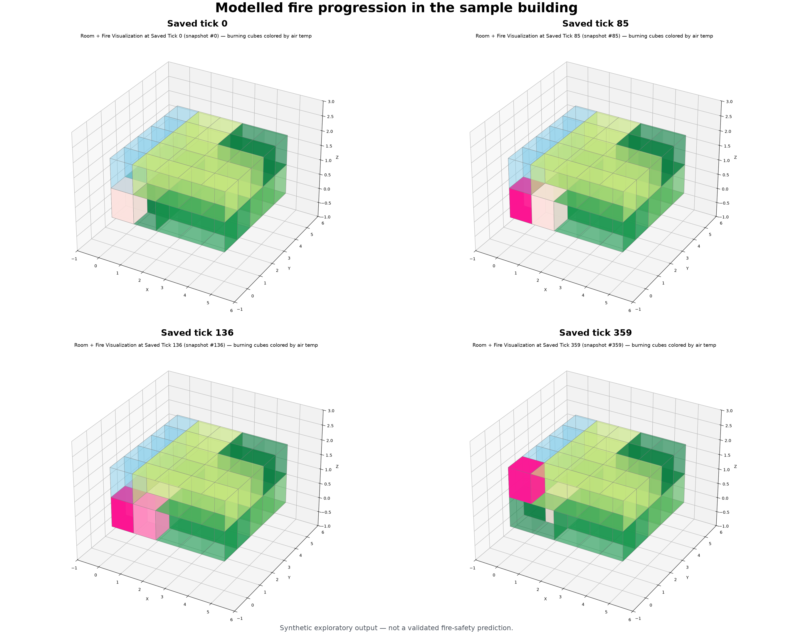
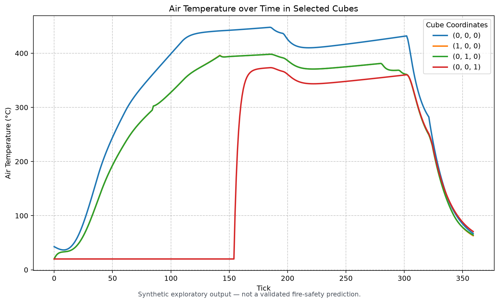

# Building Fire Simulation

> An exploratory computational model of how spatial structure, physical
> objects, fire dynamics, occupants and emergency response can interact inside
> the same three-dimensional environment.

The project investigates a modelling question rather than one predefined fire:

> **How can building-wide behaviour emerge from local interactions between
> spatial cells, physical objects and agents without hard-coding the resulting
> event?**

The implementation represents a building as connected three-dimensional cells.
Materials, combustible objects, safety devices and agents occupy that shared
space; local update rules change its state over time. The model is designed for
inspectable, reproducible computational experiments. It is not a validated
fire-engineering, evacuation or emergency-response tool.

For the modelling rationale, see
[`docs/modelling_approach.md`](docs/modelling_approach.md). For implementation
details, see [`docs/architecture.md`](docs/architecture.md).

## Modelling pipeline

```text
[Building] -> [Objects and materials] -> [Fire dynamics] -> [Safety, occupants and response] -> [Execution and history] -> [Analysis]
```

| Layer | Main responsibility |
| --- | --- |
| Building representation | Construct the three-dimensional cells and explicit relationships between them |
| Physical objects and materials | Configure structural materials, covers, contents and accessories in that space |
| Fire dynamics | Update ignition, finite heat release, cell-air temperature, cooling, degradation and inter-cell heat transfer |
| Safety systems, occupants and response | Let devices and agents observe or modify the same evolving building state |
| Scenario execution and history | Assemble a complete starting world, advance it and preserve selected state through time |
| Analysis | Inspect, tabulate and visualize results without participating in the simulation update |

Probability is not a downstream stage. It is an optional configuration layer
around selected inputs:

```text
fixed model rules + fixed parameters   -> reference run
fixed model rules + sampled parameters -> stochastic experiment
```

## Building representation

The building is discretized into cubes identified by `(x, y, z)` coordinates.
Collections of cubes form rooms, floors and the larger building. The central
spatial problem is not creating cubes but representing each boundary from both
sides.

Each cube owns four directional walls, a floor and a ceiling. Where two cubes
are adjacent, the facing surfaces are explicitly paired through
`surface_neighbor`:

```text
[surface owned by cube A] <-> [surface owned by cube B]
```

This paired-boundary design lets each side retain its own structural material,
cover and degradation state while preserving an explicit connection to the
other cell. The same relationship supports heat transfer, room openings,
occupant passage, doors, stairs, access checks and suppression reach.

Rooms are groupings of cells connected through hollow boundaries. They provide
spatial categories and agent destinations, but they are **not** well-mixed
thermodynamic zones: temperature, fire state, contents and boundaries remain
cell-level state.

`building_factory.py` follows a coordinate-first construction process:

```text
coordinates -> cubes created once -> surfaces and adjacency -> rooms -> materials, objects and accessories
```

## Physical objects and materials

`domain.py` defines the vocabulary of the simulated world: materials, cubes,
surfaces, rooms, inventory, covers, fire-safety devices, doors, windows, stairs
and access objects.

Combustion is composed into objects rather than assumed for every item:

```text
Item -> optional FireBehavior -> optional value -> subtype-specific behaviour
```

`FireBehavior` owns an object's ignition exposure, combustible energy,
heat-release curve and burnout state. A non-combustible item can exist in the
same geometry without a combustion model.

The implementation also distinguishes a surface's **structural material** from
its **combustible cover**. A structure can resist thermal degradation while a
separate cover ignites and releases heat. The same geometry can therefore
behave differently when configured with different materials and contents.

## Fire dynamics

The first prototype spread fire directly from one burning cell to another using
a probability. The current architecture instead centres on a local causal
chain:

```text
[Object or cover ignites] -> [Finite heat release] -> [Cell-air temperature]
                           -> [Boundary transfer or degradation]
                           -> [Thermal exposure in another cell] -> [New local ignition]
```

An open, hollow or degraded boundary does **not** directly ignite the receiving
cube. It permits heat transfer. Contents or covers in that cube must then meet
their own ignition conditions before becoming active combustion sources.

The core state distinctions are:

- `FireBehavior` stores object-level ignition, energy release and burnout;
- `FireState.heat` is the simulation's per-cell fire-energy buffer, not the
  cell's temperature;
- `Cube.air_temp` is the persistent modelled environmental temperature; and
- surface degradation is separate from both combustion and passage.

Ignition requires continuous exposure above a configured temperature. Burning
objects release finite energy through growth, an optional plateau and decay;
release stops at burnout or at the implemented low-output tail condition. The
simulation also applies simplified cooling, temperature transfer and structural
degradation rules.

These relationships are deliberately lumped approximations. They do not form a
conservative heat-balance solver, flame-front model or CFD calculation.

## Safety systems, occupants and emergency response

These behaviours do not run in separate abstract simulations. They read and
modify the same cubes, surfaces, objects and fire state.

- Surface-mounted smoke alarms and sprinklers use configured thresholds,
  delays, reliability and response parameters. In the current update loop they
  respond within the burning cube that contains them; stored `effect_radius`
  values are not yet used for device reach.
- Occupants occupy cells and move through the paired topology. Step checks can
  account for hollow boundaries, doors, locks, access cards, stairs, active fire
  and high temperature. The sample world combines a fixed route with a
  role-weighted, goal-oriented random walk over named rooms.
- `FireDepartment` and `FireUnit` represent alarm reception, response delay,
  grid movement, object-level suppression reach, opening nearby unlocked egress
  and limited search-and-rescue state changes.

These are functional abstractions. Occupant health, perception, smoke effects,
crowd behaviour and fire-service tactics are not validated models. Fire-unit
travel currently follows a simple Manhattan path rather than the occupant
passage checks, and callable forced-entry support is not automatically invoked
by the response loop.

## Deterministic baseline and stochastic configuration

The fire, thermal and state-transition rules are largely deterministic.
`probability_distributions.py` supplies reusable NumPy samplers, while
probabilistic hooks currently sample selected smoke-alarm and sprinkler
parameters and fire-department response time.

`probabilistic=False` disables those parameter draws and uses fixed thresholds
and timings. Device reliability gates still use Python's random generator, so a
fixed-parameter run is repeatable when that generator is seeded but is strictly
deterministic only when the reliability gates are configured to certainty. A
scenario `random_seed` seeds Python random and the NumPy generator passed to
safety devices. The current fire-department ETA sampler creates its own NumPy
generator, so one seed does not yet control every stochastic draw in a
probabilistic run.

The supplied distributions are modelling inputs, not distributions fitted to
empirical incident data. Probability changes selected configuration values; it
does not replace the causal fire process with a separate spread engine.

## Scenarios, execution, history and analysis

A scenario is one initialized world, not the model itself. `scenarios.py`
currently composes the built-in sample building, its room catalogue, two
occupants, safety systems, fire department, ignition point and run settings.
The lower-level `run_simulation()` interface can run another already-constructed
model and agent list.

Execution helpers support:

- a fixed number of ticks;
- execution until no active fires remain, with a safety cap;
- fixed or until-extinguished execution in chunks; and
- until-extinguished chunking that writes each history batch to disk and clears
  it from memory.

History is the interface between simulation and later analysis. A run can store
selected combinations of fire state, cell-air temperature, serialized
components, occupants and fire-department telemetry at a configurable interval.
Full component history remains expensive; chunking bounds in-memory history but
does not make detailed snapshots small.

`fire_analysis.py` consumes live state or recorded fields to inspect fire-state
changes, temperatures, per-object heat output and remaining energy, occupant
routes, fire-department actions and three-dimensional views. Its inventory-loss
helper reads the final live model and counts currently active flammable cube
items; it is not a complete historical damage estimator.

The separation is intentional:

```text
simulation changes state -> history preserves selected state -> analysis interprets state
```

## Current scope and limitations

The repository implements a coherent interaction model, but it is exploratory
and unvalidated. In particular:

- thermal relationships are lumped and simplified; inter-cell transfer is not
  energy-conserving;
- there is no CFD, smoke transport, oxygen model or explicit ventilation
  physics;
- there is no structural-mechanics or collapse model;
- rooms are spatial groupings, not mixed thermal or smoke zones;
- many material, device and response parameters need traceable provenance,
  unit review, sensitivity analysis and calibration;
- stochastic distributions are not established empirical uncertainty models;
- occupants do not have validated perception, health, panic, evacuation or
  crowd behaviour;
- emergency response uses simplified dispatch, routing, suppression and rescue
  rules;
- detailed snapshot history is costly for large buildings and ensembles; and
- tests check software behaviour and reproducibility properties, not physical
  validity.

Do not use this software for fire-safety design, code compliance, emergency
planning or life-safety decisions. See
[`docs/model_assumptions.md`](docs/model_assumptions.md) for the assumptions and
parameter-provenance boundary.

## Repository guide

| Path | Purpose |
| --- | --- |
| [`src/building_fire_simulation/domain.py`](src/building_fire_simulation/domain.py) | Physical and behavioural model vocabulary |
| [`src/building_fire_simulation/building_factory.py`](src/building_fire_simulation/building_factory.py) | Coordinate-first building construction, rooms and placement |
| [`src/building_fire_simulation/fire_simulation.py`](src/building_fire_simulation/fire_simulation.py) | Fire state, timestep engine, heat, degradation and snapshots |
| [`src/building_fire_simulation/agents.py`](src/building_fire_simulation/agents.py) | Occupants, passage rules, movement and emergency response |
| [`src/building_fire_simulation/probability_distributions.py`](src/building_fire_simulation/probability_distributions.py) | Optional stochastic parameter samplers |
| [`src/building_fire_simulation/scenarios.py`](src/building_fire_simulation/scenarios.py) | Explicit composition of the built-in sample world and run helpers |
| [`src/building_fire_simulation/simulation_settings.py`](src/building_fire_simulation/simulation_settings.py) | Named run and snapshot defaults |
| [`src/building_fire_simulation/simulation_runners.py`](src/building_fire_simulation/simulation_runners.py) | Fixed, stop-condition and chunked execution modes |
| [`src/building_fire_simulation/io_utils.py`](src/building_fire_simulation/io_utils.py), [`config.py`](src/building_fire_simulation/config.py) | Pickle helpers and repository-relative paths |
| [`src/building_fire_simulation/fire_analysis.py`](src/building_fire_simulation/fire_analysis.py) | Downstream extraction, tabulation and plotting |
| [`docs/modelling_approach.md`](docs/modelling_approach.md) | Narrative modelling rationale |
| [`docs/architecture.md`](docs/architecture.md) | Detailed current implementation architecture |
| [`MODEL_DEVELOPMENT_HISTORY.md`](MODEL_DEVELOPMENT_HISTORY.md) | Evidence-labelled factual development history |
| [`demo/run_demo.py`](demo/run_demo.py) | Reproducible end-to-end consumer and output generator |
| [`demo/outputs/`](demo/outputs) | Curated figures, tables and summary from the demo |
| [`scripts/`](scripts) | Optional specialist persistence, long-run and interactive workflows |
| [`tests/`](tests) | Lightweight behavioural and integration checks |

No early spreadsheet prototype is distributed in this repository. The
spreadsheet is mentioned only in the modelling history and is not part of the
active pipeline.

## Installation

Python 3.10 or newer is required.

```bash
python -m venv .venv
python -m pip install --upgrade pip
python -m pip install -e .
```

The runtime dependencies are NumPy, pandas and Matplotlib.

## Minimal run

```python
from building_fire_simulation.scenarios import run_sample_simulation

simulation = run_sample_simulation(
    nr_ticks=120,
    probabilistic=False,
    random_seed=2026,
)

print(simulation.time)
print(len(simulation.history))
```

The scenario helpers build a fresh world for each call. For custom geometry,
construct a coordinate-to-`Cube` model and pass it with agents and settings to
`building_fire_simulation.fire_simulation.run_simulation()`.

## Demonstration

The repository has one public end-to-end consumer. It constructs a fresh
`5 x 5 x 2` sample building, places two occupants, force-ignites cell
`(0, 0, 0)`, uses fixed parameters with seed `2026`, records all supported
history fields, and passes that history to the package's analysis functions.

```bash
python demo/run_demo.py
```

The run generates a deliberately small, tracked result set under
[`demo/outputs/`](demo/outputs): four figures, a Markdown and JSON summary,
occupant positions, and fire-department telemetry. See
[`demo/README.md`](demo/README.md) for the consumer boundary and regeneration
details.





The committed regression output records:

| Measure | Value |
| --- | ---: |
| Simulated duration | 360 ticks |
| Peak modelled cell-air temperature | 447.93 °C at tick 185 |
| Cells ever marked burning | 10 |
| Triggered safety devices | 3 smoke alarms, 3 sprinklers |
| First fire-department arrival | tick 136 |
| Modelled inventory-loss helper at final live state | 0.00 |

The inventory-loss helper is a narrow final-state diagnostic, not cumulative
damage or an actuarial estimate. The object-energy and heat-output figures,
agent activity, response activity and machine-readable metrics are available in
[`demo/outputs/`](demo/outputs).

The values and images explain one configured model run. They are synthetic
exploratory outputs, not validation evidence or fire-engineering findings.

## Tests

```bash
python -m unittest discover -s tests -v
python -m compileall -q src demo scripts tests
python -m pip check
```

The tests cover sample-building construction, reciprocal surface pairing, room
coordinates, explicit and absent ignition, history progression, seeded sample
behaviour, in-bounds occupant movement, configured response delay, and the
package-to-history-to-analysis integration path used by consumers.

## Data, reference and license

The public example requires no serialized data. Large development histories and
cached worlds are intentionally excluded; see [`data/README.md`](data/README.md).
One heat-release-rate concept was informed by B. Karlsson, “A mathematical model
for calculating heat release rate in the room corner test,” *Fire Safety
Journal* 20(2), 93–113 (1993),
[DOI: 10.1016/0379-7112(93)90032-L](https://doi.org/10.1016/0379-7112(93)90032-L).

The repository is distributed under the [MIT License](LICENSE).
