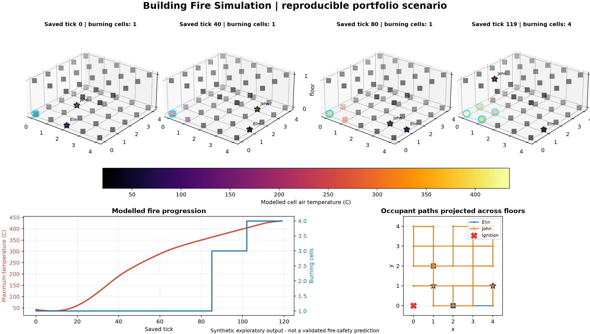
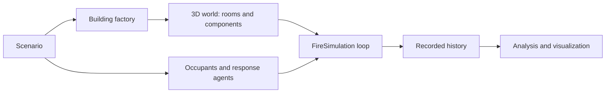

# Building Fire Simulation

A Python simulation framework for exploring interactions between fire, heat,
building materials, occupants, safety systems, and emergency response in a
three-dimensional building model.

This portfolio project demonstrates object-oriented Python, stochastic and dynamic
simulation, spatial modelling, agent behavior, risk/safety concepts, and modular
software design. It is an exploratory computational model - not a validated
fire-engineering tool.

## At a glance

- A two-floor building is represented as connected 3D cells with rooms and components.
- Materials and contents can ignite, release heat, degrade, and affect fire spread.
- Occupants move through valid spaces while reacting to environmental constraints.
- Alarms, sprinklers, and a simplified fire-department response evolve each tick.
- Seeded scenarios make stochastic runs reproducible for testing and demonstration.

## Example visualization



The figure is generated by the included portfolio scenario. Colored cells show
modelled air temperature, cyan rings identify burning cells, stars show occupants,
and the lower panels summarize fire progression and projected movement. All values
are synthetic model output.

## What the model contains

The simulated world combines:

- a 3D building graph with cubes, walls, floors, ceilings, rooms, doors, windows,
  stairs, and traversable connections;
- structural, cover, furnishing, and inventory materials with fire-related
  parameters and finite energy;
- ignition, heat-release, cooling, heat-transfer, surface-degradation, and
  fire-spread updates;
- occupants with paths and probabilistic, goal-oriented movement;
- smoke alarms, sprinklers, access controls, and building exits;
- fire-department dispatch, arrival, movement, suppression, forced entry, and search;
- selectable history snapshots plus analysis and visualization helpers.

## Model structure



The `FireSimulation` loop coordinates the existing model components; it does not
replace them with a separate simplified demonstration model.

## Simulation workflow

```text
Construct the building
        |
Place materials, contents, safety systems, and occupants
        |
Ignite a known cell
        |
Advance one discrete timestep
        |
Update ignition, heat, degradation, spread, agents, cooling, and response
        |
Record selected state
        |
Analyse and visualize the history
```

## Reproducible example scenario

The portfolio example constructs the built-in 5 x 5 x 2 building, places two
occupants, ignites cell `(0, 0, 0)`, configures the fire-department response, and
runs 120 ticks with random seed `2026`. It saves the curated figure above and a
small JSON result summary.

The verified reference run recorded 120 snapshots, reached a maximum modelled cell
temperature of 434.65 C, and had four burning cells at the final saved tick.

```bash
python examples/run_example.py
```

Generated files:

- `docs/images/fire_simulation_overview.png` - curated visual suitable for the README;
- `outputs/example_summary.json` - ignored, machine-readable run summary.

## Installation

Python 3.10 or newer is recommended.

```bash
python -m venv .venv
python -m pip install --upgrade pip
python -m pip install -e .
```

Activate the virtual environment using the command appropriate for your operating
system before installing. The dependency set is intentionally small: NumPy, pandas,
and Matplotlib.

## Python usage

```python
from fire_building_sim.scenarios import run_sample_simulation

simulation = run_sample_simulation(
    nr_ticks=120,
    probabilistic=True,
    random_seed=2026,
)

print(simulation.time)
print(len(simulation.history))
```

Advanced fixed-tick, until-extinguished, chunked-history, and analysis helpers are
available in `fire_building_sim/scenarios.py`, `simulation_runners.py`, and
`fire_analysis.py`.

## Project structure

```text
building-fire-simulation/
|-- fire_building_sim/
|   |-- domain.py                    # materials, contents, components, rooms
|   |-- building_factory.py          # spatial construction and sample building
|   |-- agents.py                    # occupants, movement, fire department
|   |-- fire_simulation.py           # timestep, fire, heat, spread, snapshots
|   |-- scenarios.py                 # explicit world/scenario composition
|   |-- simulation_runners.py        # fixed, chunked, and stop-condition runners
|   |-- fire_analysis.py             # history analysis and plotting
|   `-- probability_distributions.py # seeded NumPy distribution helpers
|-- examples/run_example.py          # one-command portfolio demonstration
|-- tests/                           # lightweight behavioral tests
|-- docs/                            # assumptions and curated image
|-- data/                            # ignored local/generated development data
`-- outputs/                         # ignored generated run summaries
```

The package retains the architecture and detailed object catalogues developed in the
original notebook-based project. Scenario functions now create dependencies
explicitly, so no hidden notebook execution order or pre-existing globals are needed.

## Testing

From the repository root:

```bash
python -m unittest discover -s tests -v
python -m compileall -q fire_building_sim examples tests
python -m pip check
```

The tests cover sample-building construction, reciprocal adjacency, valid room
coordinates, explicit ignition, lack of spontaneous ignition in a cool world,
history progression, seeded reproducibility, in-bounds agent movement, and configured
fire-department response timing.

## Modelling assumptions and limitations

The model uses discrete cells and timesteps, lumped cell-air temperatures, simplified
heat transfer/cooling, threshold-based ignition, finite object energy, abstracted
ventilation, rule-based occupants, and a simplified emergency response. It does not
solve computational fluid dynamics, detailed smoke transport, structural mechanics,
or regulatory tenability calculations.

Parameter values have not been calibrated as a validated material database. Important
assumptions and provenance are documented in
[docs/model_assumptions.md](docs/model_assumptions.md).

Do not use this software for fire-safety design, code compliance, emergency planning,
or life-safety decisions.

## Data and references

The public example requires no serialized data. Large pickle histories, cached sample
worlds, and an externally authored background PDF are excluded from Git. A relevant
background reference is B. Karlsson, "A mathematical model for calculating heat
release rate in the room corner test," *Fire Safety Journal* 20(2), 93-113 (1993),
[DOI: 10.1016/0379-7112(93)90032-L](https://doi.org/10.1016/0379-7112(93)90032-L).

## Future work

- validate selected parameters and outputs against documented experimental cases;
- add sensitivity/uncertainty analysis for key fire and response parameters;
- refine ventilation, smoke exposure, and route planning without changing the
  package's core modelling approach.

## Technologies

Python - NumPy - pandas - Matplotlib - object-oriented modelling - stochastic
simulation - 3D spatial systems - agent-based behavior

## License

No license has been selected yet. Choosing and adding a `LICENSE` file is a required
manual step before public release.
